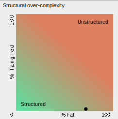
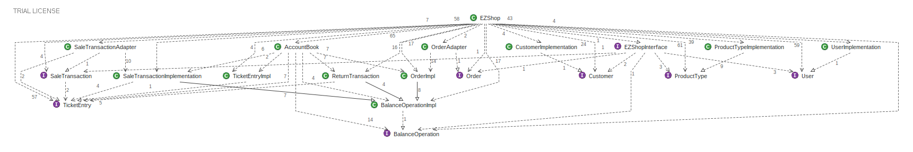

# Design assessment


```
<The goal of this document is to analyse the structure of your project, compare it with the design delivered
on April 30, discuss whether the design could be improved>
```

# Levelized structure map
```
<Applying Structure 101 to your project, version to be delivered on june 4, produce the Levelized structure map,
with all elements explosed, all dependencies, NO tangles; and report it here as a picture>
```

# Structural over complexity chart
```
<Applying Structure 101 to your project, version to be delivered on june 4, produce the structural over complexity chart; and report it here as a picture>
```


# Size metrics

```
<Report here the metrics about the size of your project, collected using Structure 101>
```


| Metric                                    | Measure |
| ----------------------------------------- | ------- |
| Packages                                  | 5       |
| Classes (outer)                           | 40      |
| Classes (all)                             | 41      |
| NI (number of bytecode instructions)      | 8,360   |
| LOC (non comment non blank lines of code) | ~3,595  |


# Items with XS

```
<Report here information about code tangles and fat packages>
```

| Item                                                                                                              | Tangled |  Fat |  Size |    XS |
| ----                                                                                                              | ------- | ---- |  ---- |  ---- |
| ezshop.it.polito.ezshop.data.EZShop                                                                               |         |  266 | 6,406 | 3,516 |
| ezshop.it.polito.ezshop.data.EZShop.deleteReturnTransaction(java.lang.Integer):boolean                            |         |   21 |   285 |    81 |
| ezshop.it.polito.ezshop.data.EZShop.endReturnTransaction(java.lang.Integer, boolean):boolean                      |         |   17 |   280 |    32 |
| ezshop.it.polito.ezshop.data.EZShop.addProductToSale(java.lang.Integer, java.lang.String, int):boolean            |         |   17 |   199 |    23 |
| ezshop.it.polito.ezshop.data.EZShop.recordOrderArrival(java.lang.Integer):boolean                                 |         |   17 |   195 |    22 |
| ezshop.it.polito.ezshop.data.EZShop.deleteProductFromSale(java.lang.Integer, java.lang.String, int):boolean       |         |   17 |   172 |    20 |
| ezshop.it.polito.ezshop.data.EZShop.modifyCustomer(java.lang.Integer, java.lang.String, java.lang.String):boolean |         |   16 |   165 |    10 |


# Package level tangles

```
<Report screen captures of the package-level tangles by opening the items in the "composition perspective" 
(double click on the tangle from the Views->Complexity page)>
```




# Summary analysis
```
<Discuss here main differences of the current structure of your project vs the design delivered on April 30>
<Discuss if the current structure shows weaknesses that should be fixed>
```
We have decided to remove the follwing 3 classes:
- CreditCardSystem = It was not needed anymore, since interfacing with a file .txt is actually quite simple.
- Position = since we do not need to track a list of positions from ezshop, it was superfluos.
- LoyaltyCard = similar to position, we had not the necessity of track each LoyaltyCard by itself, since they actually only exist if associated to a customer.

We have also added the following adapters:
- SaleTransactionAdapter = needed in order to be able to extend both BalanceOperation and implement the SaleTransactionInterface.
- OrderAdapter = needed in order to be able to extend both BalanceOperation and implement the OrderInterface.

We have added 3 public methods in ezshop to support existing functionalities and to support persistency.
- Integer assignId(in Set Integer ids)
- boolean writejArrayToFile(in String filepath, in JSONArray jArr)
- boolean barcodeIsValid(in String barcode)

The structure presents very minimal tangling. The main problem with the design is the "fatness".
The "fatness", is mainly present because of the design decision of delegating almost all logic to the EzShop Class.
A possible solution to reduce this problem would have been to split the logic among more modular classes in order to decrease the amount of dependencies.


