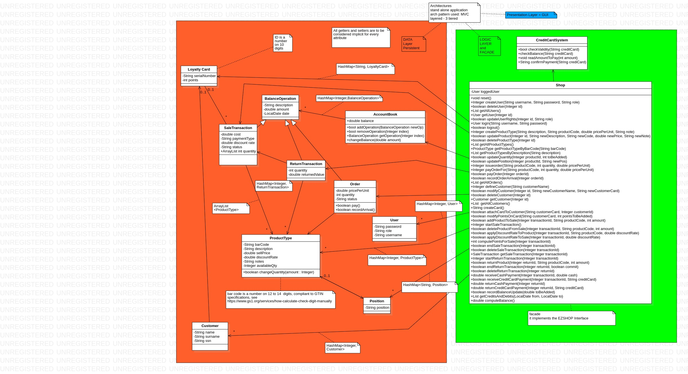
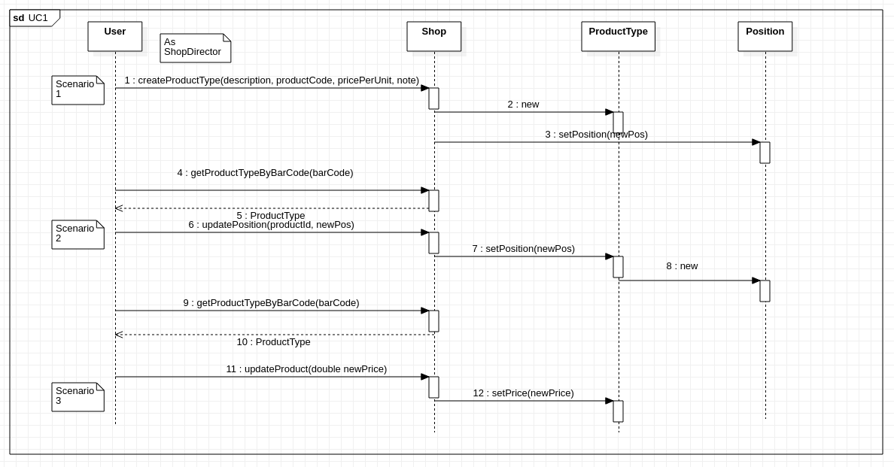
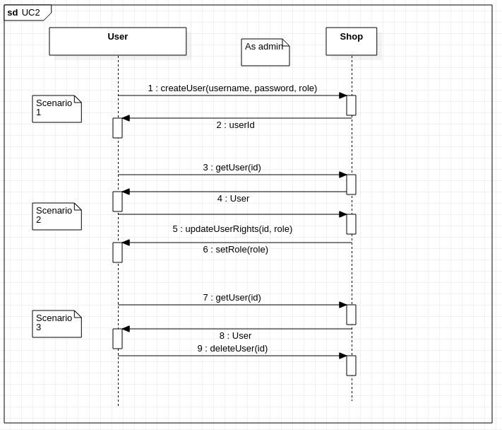
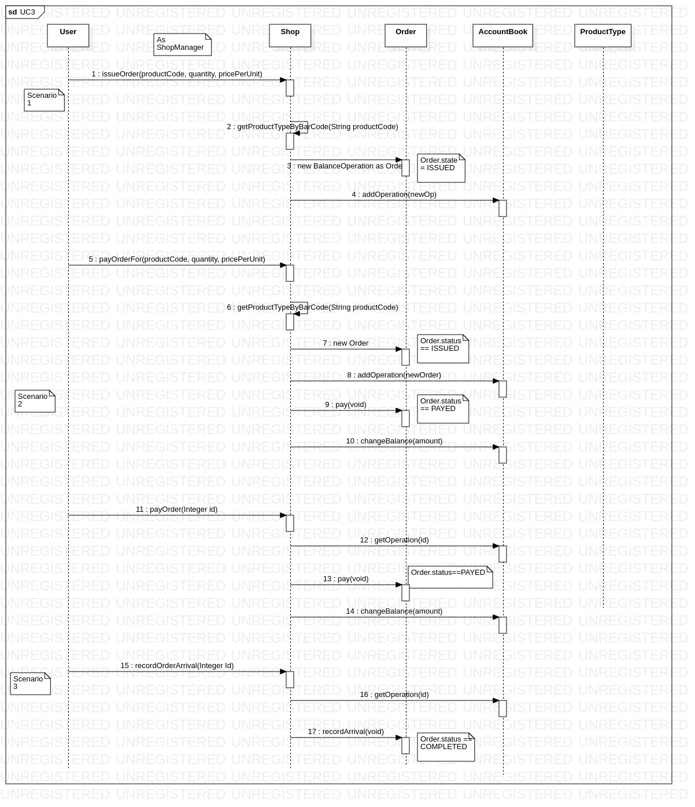

# Design Document 

Authors: Andrea Di Mauro, Alessio Bincoletto, Daniele Cacciabue (Team 15)

Date: 30/05/2021

Version: 1.0

# Contents

- [Design Document](#design-document)
- [Contents](#contents)
- [Instructions](#instructions)
- [High level design](#high-level-design)
- [Low level design](#low-level-design)
- [Verification traceability matrix](#verification-traceability-matrix)
- [Verification sequence diagrams](#verification-sequence-diagrams)

# Instructions

The design must satisfy the Official Requirements document, notably functional and non functional requirements

# High level design 

Architectural pattern: 3 tier layer with Model View Controller

# Low level design

# Verification traceability matrix

|        | shop  | AccountBook | BalanceOperation | User  | Order | ProductType | Position | ReturnTransaction | CreditCardSystem | SaleTransaction | LoyaltyCard | Customer |
| :----: | :---: | :---------: | :--------------: | :---: | :---: | :---------: | :------: | :---------------: | :--------------: | :-------------: | :---------: | :------: |
|  FR1   |       |             |                  |       |       |             |          |                   |                  |                 |             |          |
| FR1.1  |   X   |             |                  |   X   |       |             |          |                   |                  |                 |             |          |
| FR1.2  |   x   |             |                  |       |       |             |          |                   |                  |                 |             |          |
| FR1.3  |   x   |             |                  |       |       |             |          |                   |                  |                 |             |          |
| FR1.4  |   x   |             |                  |       |       |             |          |                   |                  |                 |             |          |
| FR1.5  |   x   |             |                  |   x   |       |             |          |                   |                  |                 |             |          |
|  FR3   |       |             |                  |       |       |             |          |                   |                  |                 |             |          |
| FR3.1  |   x   |             |                  |       |       |      x      |          |                   |                  |                 |             |          |
| FR3.2  |   x   |             |                  |       |       |             |          |                   |                  |                 |             |          |
| FR3.3  |   x   |             |                  |       |       |      x      |          |                   |                  |                 |             |          |
| FR3.4  |   x   |             |                  |       |       |      x      |          |                   |                  |                 |             |          |
|  FR4   |       |             |                  |       |       |             |          |                   |                  |                 |             |          |
| FR4.1  |   x   |             |                  |       |       |      x      |          |                   |                  |                 |             |          |
| FR4.2  |   x   |             |                  |       |       |      x      |    x     |                   |                  |                 |             |          |
| FR4.3  |   x   |      x      |        x         |       |   x   |      x      |          |                   |                  |                 |             |          |
| FR4.4  |   x   |      x      |        x         |       |   x   |      x      |          |                   |                  |                 |             |          |
| FR4.5  |   x   |      x      |                  |       |   x   |             |          |                   |                  |                 |             |          |
| FR4.6  |   x   |      x      |                  |       |   x   |      x      |          |                   |                  |                 |             |          |
| FR4.7  |   x   |      x      |                  |       |   x   |             |          |                   |                  |                 |             |          |
|  FR 5  |   x   |             |                  |       |       |             |          |                   |                  |                 |             |    x     |
| FR5.1  |   x   |             |                  |       |       |             |          |                   |                  |                 |             |    x     |
| FR5.2  |   x   |             |                  |       |       |             |          |                   |                  |                 |             |    x     |
| FR5.3  |   x   |             |                  |       |       |             |          |                   |                  |                 |             |    x     |
| FR5.4  |   x   |             |                  |       |       |             |          |                   |                  |                 |             |    x     |
| FR5.5  |   x   |             |                  |       |       |             |          |                   |                  |                 |      x      |          |
| FR5.6  |   x   |             |                  |       |       |             |          |                   |                  |                 |      x      |    x     |
| FR5.7  |   x   |             |                  |       |       |             |          |                   |                  |                 |      x      |          |
|  FR6   |   x   |             |        x         |       |       |      x      |          |                   |                  |        x        |      x      |          |
| FR6.1  |   x   |             |        x         |       |       |             |          |                   |                  |        x        |             |          |
| FR6.2  |   x   |             |                  |       |       |      x      |          |                   |                  |        x        |             |          |
| FR6.3  |   x   |             |                  |       |       |      x      |          |                   |                  |        x        |             |          |
| FR6.4  |   x   |             |                  |       |       |             |          |                   |                  |        x        |             |          |
| FR6.5  |   x   |             |                  |       |       |      x      |          |                   |                  |        x        |             |          |
| FR6.6  |   x   |             |                  |       |       |             |          |                   |                  |        x        |      x      |          |
| FR6.10 |   x   |      x      |                  |       |       |      x      |          |                   |                  |        x        |             |          |
| FR6.11 |   x   |      x      |                  |       |       |             |          |                   |                  |        x        |             |          |
| FR6.12 |   x   |             |        x         |       |       |      x      |          |         x         |                  |        x        |             |          |
| FR6.13 |   x   |             |                  |       |       |             |          |                   |                  |                 |             |          |
| FR6.14 |   x   |             |                  |       |       |             |          |         x         |                  |                 |             |          |
| FR6.15 |   x   |      x      |                  |       |       |      x      |          |         x         |                  |                 |             |          |
|  FR7   |   x   |             |                  |       |       |             |          |                   |        x         |                 |             |          |
| FR7.1  |   x   |      x      |                  |       |       |             |          |                   |                  |        x        |             |          |
| FR7.2  |   x   |      x      |                  |       |       |             |          |                   |        x         |        x        |             |          |
| FR7.3  |   x   |      x      |                  |       |       |             |          |                   |                  |                 |             |          |
| FR7.4  |   x   |      x      |                  |       |       |             |          |                   |        x         |                 |             |          |
|  FR8   |   x   |             |                  |       |       |             |          |                   |                  |                 |             |          |
| FR8.1  |   x   |      x      |        x         |       |       |             |          |                   |                  |                 |             |          |
| FR8.2  |   x   |      x      |        x         |       |       |             |          |                   |                  |                 |             |          |
| FR8.3  |   x   |      x      |                  |       |       |             |          |                   |                  |                 |             |          |
| FR8.4  |   x   |      x      |                  |       |       |             |          |                   |                  |                 |             |          |

# Verification sequence diagrams 
Some scenarios among Use Cases 1 - 2 - 3 - 6 have been selected as key scenarios

### UC1

### UC2

### UC3

### UC6

