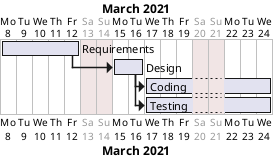

1
2
3
4
5
6
7
8
9
10
11
12
13
14
15
16
17
18
19
20
21
22
23
24
25
26
27
28
29
30
31
32
33
34
35
36
37
38
39
40
41
42
43
44
45
46
47
48
49
50
51
# Project Estimation  
Authors:
Date:
Version:
# Contents
- [Estimate by product decomposition]
- [Estimate by activity decomposition ]
# Estimation approach
Estimation is based on our EZShop Project, considering a team of 4 people working 8h per day, 5 days per week.
Estimation by product decomposition gives an estimation result 30% lower in terms of active days of work if compared to the estimation by activity decomposition visualized as a gantt chart.
This is due to the fact that estimation by product decomposition, computing the calendar time, doesn't take into  account the impossibility to parallelize some phases of the work such as creating Requirement documents and Design.
therefore estimation by product decomposition might be better to estimate the size of the final product to deliver while by activity decomposition is better to estimate calendar time and Person Hours.
# Estimate by product decomposition
### 
|             | Estimate                        |             
| ----------- | ------------------------------- |  
| NC =  Estimated number of classes to be developed   |   21   |             
|  A = Estimated average size per class, in LOC       |    150  | 
| S = Estimated size of project, in LOC (= NC * A) |  3150  |
| E = Estimated effort, in person hours (here use productivity 10 LOC per person hour)  |     315      |   
| C = Estimated cost, in euro (here use 1 person hour cost = 30 euro) | 9450€ | 
| Estimated calendar time, in calendar weeks (Assume team of 4 people, 8 hours per day, 5 days per week ) |    2 calendar weekss   (10 day of active work)        |               
# Estimate by activity decomposition
### 
|         Activity name    | Estimated effort (person hours)   |             
| ----------- | ------------------------------- | 
| Requirements | 72 |
| Design | 32 |
| Coding | 80 |
| Testing | 80 |
###

**Requirements**: only 2 people work at the same time, since low parallel work is possible in this phase.\
**Design**: only 2 people working at the same time,  since low parallel work is possible in this phase.\
**Coding and Testing**: Estimation Is based on a team of 4 people working at the project 8 hours per day, 5 days per week, writing code and tests at the same time divided in 2 sub-teams of 2 persons each.