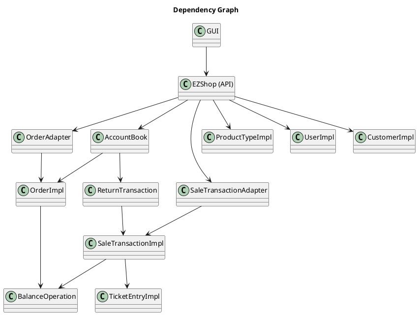

# Integration and API Test Documentation

Authors: Andrea Di Mauro, Alessio Bincoletto, Daniele Cacciabue (Team 15)

Date: 26/05/2021

Version: 1.0

# Contents

- [Integration and API Test Documentation](#integration-and-api-test-documentation)
- [Contents](#contents)
- [Dependency graph](#dependency-graph)
- [Integration approach](#integration-approach)
- [Tests](#tests)
  - [Step 1](#step-1)
  - [Step 2](#step-2)
  - [Step 3](#step-3)
  - [Step 4](#step-4)
  - [Step 5](#step-5)
- [Scenarios](#scenarios)
  - [Scenario UCx.y](#scenario-ucxy)
- [Coverage of Scenarios and FR](#coverage-of-scenarios-and-fr)
- [Coverage of Non Functional Requirements](#coverage-of-non-functional-requirements)

# Dependency graph 

# Integration approach

    <Write here the integration sequence you adopted, in general terms (top down, bottom up, mixed) and as sequence
    (ex: step1: class A, step 2: class A+B, step 3: class A+B+C, etc)> 
    <Some steps may  correspond to unit testing (ex step1 in ex above), presented in other document UnitTestReport.md>
    <One step will  correspond to API testing>

- Integration sequence = Bottom up

#  Tests

   <define below a table for each integration step. For each integration step report the group of classes under test, and the names of
     JUnit test cases applied to them> JUnit test classes should be here src/test/java/it/polito/ezshop

## Step 1

| Classes                   | JUnit test cases                                             |
| ------------------------- | ------------------------------------------------------------ |
| CustomerImplementation    | EZShopTests/SaleTransactionImplementationTests - testSaleTransactionImpl |
| UserImplementation        | EZShopTests/OrderImplementationTests - testOrderImpl         |
| ProductTypeImplementation | EZShopTests/ProductTypeImplementationTest  -testProduct   -testProduct1  -testProduct2 |
| TicketEntryImpl           | EZShopTests/TicketEntryImplementationTest -testTicket        |
| BalanceOperation          | EZShopTests/OrderImplementationTests -testCreditDebit -testBalanceSetters |

## Step 2

| Classes                                                      | JUnit test cases                                             |
| ------------------------------------------------------------ | ------------------------------------------------------------ |
| TicketEntryImpl + BalanceOperation + SaleTransactionImplementation | EZShopTests/SaleTransactionImplementationTests - testSaleTransactionImpl |
| OrderImplementation + BalanceOperation                       | EZShopTests/OrderImplementationTests - testOrderImpl         |

## Step 3
| Classes                                                      | JUnit test cases                                             |
| ------------------------------------------------------------ | ------------------------------------------------------------ |
| BalanceOperation + OrderImpl + OrderAdapter                  | EZShopTests/OrderAdapterTests - testOrderImpl                |
| TicketEntryImpl + BalanceOperation + ReturnTransaction       | EZShopTests/SaleTransactionImplementationTests -testReturnTransaction |
| TicketEntryImpl + BalanceOperation + SaleTransactionImplementation + SaleTransactionAdapter | EZShopTests/SaleTransactionAdapterTests - testOrderAdapter   |

## Step 4
| Classes                                                      | JUnit test cases                                             |
| ------------------------------------------------------------ | ------------------------------------------------------------ |
| BalanceOperation + TicketEntryImpl+ SaleTransactionImplementation + OrderImpl + ReturnTransaction + AccountBook | EZShopTests/AccountBookTest -testSetters -testGetFilepath -testChangeBalance -testAddOperation |
|                                                              |                                                              |

## Step 5 (API Testing)

   

| Classes                                                      | JUnit test cases                                             |
| ------------------------------------------------------------ | ------------------------------------------------------------ |
| UserImplementation + EZShop                                  | EZShopTests/EZShopTests - testUserAPIs                       |
| ProductTypeImpl + EZShop                                     | EZShopTests/EZShopTests - testProductTypeAPIs                |
| CustomerImplementation + EZShop                              | EZShopTests/EZShopTests - testCustomerAPIs                   |
| SaleTransactionImplementation + SaleTransactionAdapter + EZShop | EZShopTests/EZShopTests - testSaleTransactionAPIs            |
| OrderImpl + OrderAdapter + EZShop                            | EZShopTests/EZShopTests - testOrderAPIs                      |
| EZShop                                                       | EZShopTests/EZShopTests - testResetAPI EZShopTests/EZShopTests - testAssignId EZShopTests/EZShopTests - testBarcodeIsValid EZShopTests/EZShopTests - testWriteJarrayToFIle EZShopTests/EZShopTests - testValidateCard |
| EZShop + Accountbook + OrderAdapter + Order + SaleTransactionAdapter + SaleTransaction + ticketEntry | EZShopTests/EZShopTests - testBalanceRelatedAPIs             |
| EZShop + receiveCreditCardPayment, receiveCashPayment, returnCreditCardPayment, returnCashPayment | EZShopTests/EZShopTests - testPaymentAPIs                    |

# Scenarios

<If needed, define here additional scenarios for the application. Scenarios should be named
 referring the UC in the OfficialRequirements that they detail>

## Scenario UCx.y

| Scenario       | name            |
| -------------  | :-------------: |
| Precondition   |                 |
| Post condition |                 |
| Step#          | Description     |
| 1              | ...             |
| 2              | ...             |

# Coverage of Scenarios and FR

<Report in the following table the coverage of  scenarios (from official requirements and from above) vs FR. 
Report also for each of the scenarios the (one or more) API JUnit tests that cover it. >

| Scenario ID                         | Functional Requirements covered         | JUnit  Test(s)                                      |
| ----------------------------------- | --------------------------------------- | --------------------------------------------------- |
| From 2.1 to 2.3 and from 5.1 to 5.2 | all FR1 subrequirements                 | EZShopTests/EZShopTests - testUserAPIs              |
| From 1.1 to 1.3                     | all FR3 subrequirements + FR4.1 + FR4.2 | EZShopTests/EZShopTests - testProductTypeAPIs       |
| From 3.1 to 3.3                     | FR4.3 to FR4.7                          | EZShopTests/EZShopTests - testOrderAPIs             |
| From 4.1 to 4.4                     | all FR5 subrequirements                 | EZShopTests/EZShopTests - testCustomerAPIs          |
| 6.1 to 6.6                          | FR6.1 to FR6.6 and FR6.10 to FR6.11     | EZShopTests/EZShopTests - testSaleTransactionAPIs   |
| 8.1 , 8.2                           | FR6.12 to FR6.15                        | EZShopTests/EZShopTests - testReturnTransactionAPIs |
| 7.1 to 7.4                          | FR7.1 to FR7.4                          | EZShopTests/EZShopTests - testPaymentAPIs           |
| 9.1                                 | all FR8 subrequirements                 | EZShopTests/EZShopTests - testBalanceRelatedAPIs    |
|                                     |                                         |                                                     |
|                                     |                                         |                                                     |

# Coverage of Non Functional Requirements

<Report in the following table the coverage of the Non Functional Requirements of the application - only those that can be tested with automated testing frameworks.>

### 

| Non Functional Requirement | Test name                                    |
| -------------------------- | -------------------------------------------- |
| NFR4                       | EZShopTests/EZShopTests - testBarcodeIsValid |
| NFR5                       | EZShopTests/EZShopTests - testValidateCard   |
| NFR6                       | EZShopTests/EZShopTests - testCustomerAPIs   |

