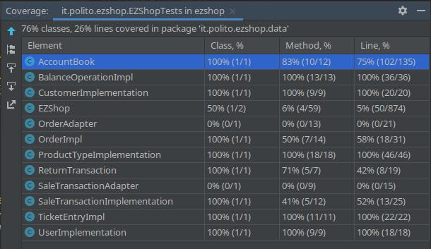

# Unit Testing Documentation

Authors: Andrea Di Mauro, Alessio Bincoletto, Daniele Cacciabue

Date:	13/05/2021

Version: 1.0

___________________________
# Contents

- [Black Box Unit Tests](#black-box-unit-tests)
  - [CustomerImplementation](#customerimplementation)
  - [ProductTypeImplementation](#producttypeimplementation)
  - [UserImplementation](#user)
  - [TicketEntry](#ticketentry)
  - [EZShop](#ezshop)
  - [AccountBook](#accountbook)
  - [ProductRfid](#productrfid)
- [White box unit tests](#white-box-unit-tests)

# Black Box Unit Tests

    <Define here criteria, predicates and the combination of predicates for each function of each class.
    Define test cases to cover all equivalence classes and boundary conditions.
    In the table, report the description of the black box test case and (traceability) the correspondence with the JUnit test case writing the 
    class and method name that contains the test case>
    <JUnit test classes must be in src/test/java/it/polito/ezshop   You find here, and you can use,  class TestEzShops.java that is executed  
    to start tests
    >
## CustomerImplementation
### **Class *CustomerImplementation* - method *public CustomerImplementation(String name, Integer id, Integer points, String customerCard)***

**Criteria for Constructor *CustomerImplementation(String name, Integer id, Integer points, String customerCard)*:**

**Predicates for method **:**

| Criteria             | Predicate                        |
| -------------------- | --------------------------       |
| type of name         | Any String                       |
|                      |                                  |
| type of id           | Any Integer                      |
|                      |                                  |
| type of points       | Any Integer                      |
|                      |                                  |
| CustomerCard value   | customerCard.matches("\\d{10}")  |
|                      | customerCard is  null            |
|                      | !customerCard.matches("\\d{10}") |

**Boundaries**:
no boundaries for the first three criteria, since they only consist of 1 single equivalence class
no boundaries for the fourth criteria, since boundaries cannot be stated for string values

**Combination of predicates**:

| Criteria 4                      | Criteria 1 to 3 | Valid / Invalid | Description of the test case                                            | JUnit test case      |
|---------------------------------|-----------------|-----------------|-------------------------------------------------------------------------|----------------------|
| customercard is null            | *               | Valid           | T("andrea", 1, 5, null)  => customer with given attributes              | testCustomer()       |
| customercard matches "\\d{10}"  | *               | "               | T("marina blue", 3, 40, "1038475839") => customer with given attributes | testCustomerConstr() |
| customercard !matches "\\d{10}" | **              | "               | T("Rob Robinson", 4, 2, "2383") => customer with creditCard=null        | testCustomerConstr() |

### **Class *CustomerImplementationTest* - method *setCustomerName()***

**Criteria for method *setCustomerName***:

**Predicates for method *setCustomerName*:**

| Criteria | Predicate |
| -------- | --------- |

**Boundaries**:

| Criteria | Boundary values |
| -------- | --------------- |

**Combination of predicates**:

| Criteria 1 | Valid / Invalid | Description of the test case                                                                                   | JUnit test case |
| ---------- | --------------- | ------------------------------------------------------------                                                   | --------------- |
| *          | Valid           | Object Customer is instantiated customer.setCustomerName("alessio"); value is checked through the getter | testCustomer()  |

### **Class *CustomerImplementationTest* - method *setCustomerCard()***

**Criteria for method *setCustomerCard***:

**Predicates for method *setCustomerCard*:**

| Criteria | Predicate |
| -------- | --------- |

**Boundaries**:

| Criteria | Boundary values |
| -------- | --------------- |

**Combination of predicates**:

| Criteria 1 | Valid / Invalid | Description of the test case                                 | JUnit test case |
| ---------- | --------------- | ------------------------------------------------------------ | --------------- |
| *          | Valid           | Object Customer is instantiated customer.setCustomerCard("9000648221"); value is checked through the getter | testCustomer()  |

### **Class *CustomerImplementationTest* - method *setId()***

**Criteria for method *setCustomerId***:

**Predicates for method *setCustomerId*:**

| Criteria | Predicate |
| -------- | --------- |

**Boundaries**:

| Criteria | Boundary values |
| -------- | --------------- |

**Combination of predicates**:

| Criteria 1 | Valid / Invalid | Description of the test case                                 | JUnit test case |
| ---------- | --------------- | ------------------------------------------------------------ | --------------- |
| *          | Valid           | Object Customer is instantiated customer.setId(10); value is checked through the getter | testCustomer()  |

### **Class *CustomerImplementationTest* - method *setPoints()***

**Criteria for method *setPoints***:

**Predicates for method *setPoints*:**

| Criteria | Predicate |
| -------- | --------- |

**Boundaries**:

| Criteria | Boundary values |
| -------- | --------------- |

**Combination of predicates**:

| Criteria 1 | Valid / Invalid | Description of the test case                                 | JUnit test case |
| ---------- | --------------- | ------------------------------------------------------------ | --------------- |
| *          | Valid           | Object Customer is instantiated customer.setPoints(-3); value is checked through the getter | testCustomer()  |

## UserImplementation
### **Class *UserImplementationTest* - method *setId()***

**Criteria for method *setId***:

**Predicates for method *setId*:**

| Criteria | Predicate |
| -------- | --------- |

**Boundaries**:

| Criteria | Boundary values |
| -------- | --------------- |

**Combination of predicates**:

| Criteria 1 | Valid / Invalid | Description of the test case                                 | JUnit test case |
| ---------- | --------------- | ------------------------------------------------------------ | --------------- |
| *          | Valid           | Object User is instantiated user.setId(20); value is checked through the getter | testUser()      |

### **Class *UserImplementationTest* - method *setUsername()***

**Criteria for method *setUsername***:

**Predicates for method *setUsername*:**

| Criteria | Predicate |
| -------- | --------- |

**Boundaries**:

| Criteria | Boundary values |
| -------- | --------------- |

**Combination of predicates**:

| Criteria 1 | Valid / Invalid | Description of the test case                                 | JUnit test case |
| ---------- | --------------- | ------------------------------------------------------------ | --------------- |
| *          | Valid           | Object User is instantiated user.setUsername("alessio"); value is checked through the getter | testUser()      |

### **Class *UserImplementationTest* - method *setPassword()***

**Criteria for method *setPassword***:

**Predicates for method *setPassword*:**

| Criteria | Predicate |
| -------- | --------- |

**Boundaries**:

| Criteria | Boundary values |
| -------- | --------------- |

**Combination of predicates**:

| Criteria 1 | Valid / Invalid | Description of the test case                                 | JUnit test case |
| ---------- | --------------- | ------------------------------------------------------------ | --------------- |
| *          | Valid           | Object User is instantiated user.setPassword("456"); value is checked through the getter | testUser()      |

### **Class *UserImplementationTest* - method *setRole()***

**Criteria for method *setRole***:

**Predicates for method *setRole*:**

| Criteria | Predicate |
| -------- | --------- |

**Boundaries**:

| Criteria | Boundary values |
| -------- | --------------- |

**Combination of predicates**:

| Criteria 1 | Valid / Invalid | Description of the test case                                 | JUnit test case |
| ---------- | --------------- | ------------------------------------------------------------ | --------------- |
| *          | Valid           | Object User is instantiated user.setRole("Administrator"); value is checked through the getter | testUser()      |

## ProductTypeImplementation
### **Class *ProductTypeImplementation* - method *public ProductTypeImplementation(Integer id, String barCode, String description, double sellPrice, String note)***

**Criteria for method *ProductTypeImplementation(ProductType p)*:**

**Predicates for method *ProductTypeImplementation*:**

| Criteria             | Predicate                  |
| -------------------- | -------------------------- |
| p validity           | p is not null              |

**Boundaries**:

No boundaries, we consider one single equivalent class for any of the input arguments.

**Combination of predicates**:

| Criteria 1 | Valid / Invalid | Description of the test case                                                              | JUnit test case |
| ---------- | --------------- | ------------------------------------------------------------                              | --------------- |
| p validity | invalid         | T(null)  expect NullPointerException                                                      | testProduct2()  |
| p validity | valid           | T(ProductTypeImplementation(8, "000000000002", "banane", 1.0, "note1", 9, "djas-12-djs")) | testProduct2()  |

### **Class *ProductTypeImplementation* - method *changeQuantity()***

**Criteria for method *name*:**

 - Type of the argument

**Predicates for method *name*:**

| Criteria             | Predicate                  |
| -------------------- | -------------------------- |
| Sign of the argument | Integer >= 0 \| <0 *valid* |
|                      | null *not valid*           |

**Boundaries**:

| Criteria | Boundary values |
| -------- | --------------- |

**Combination of predicates**:

| Criteria 1         | Valid / Invalid | Description of the test case                                 | JUnit test case |
| ------------------ | --------------- | ------------------------------------------------------------ | --------------- |
| null               | Invalid         | changeQuantity(null)                                         | testProduct()   |
| Integer >= 0 \| <0 | Valid           | changeQuantity(7) changeQuantity(0) changeQuantity(-5)  | ""              |
### **Class *ProductTypeImplementationTest* - method *setQuantity()***

**Criteria for method *setAmount***:

**Predicates for method *setAmount*:**

| Criteria | Predicate |
| -------- | --------- |

**Boundaries**:

| Criteria | Boundary values |
| -------- | --------------- |

**Combination of predicates**:

| Criteria 1 | Valid / Invalid | Description of the test case                                                                       | JUnit test case |
| ---------- | --------------- | ------------------------------------------------------------                                       | --------------- |
| *          | Valid           | Object TicketEntry is instantiated ticket.setQuantity(3); value is checked through the getter  | testProduct()   |
### **Class *ProductTypeImplementationTest* - method *setLocation()***

**Criteria for method *setLocation***:

**Predicates for method *setLocation*:**

| Criteria | Predicate |
| -------- | --------- |

**Boundaries**:

| Criteria | Boundary values |
| -------- | --------------- |

**Combination of predicates**:

| Criteria 1 | Valid / Invalid | Description of the test case                                 | JUnit test case |
| ---------- | --------------- | ------------------------------------------------------------ | --------------- |
| *          | Valid           | Object Product is instantiated product.setLocation("location5"); value is checked through the getter | testProduct()   |

### **Class *ProductTypeImplementationTest* - method *setNote()***

**Criteria for method *setNote***:

**Predicates for method *setNote*:**

| Criteria | Predicate |
| -------- | --------- |

**Boundaries**:

| Criteria | Boundary values |
| -------- | --------------- |

**Combination of predicates**:

| Criteria 1 | Valid / Invalid | Description of the test case                                 | JUnit test case |
| ---------- | --------------- | ------------------------------------------------------------ | --------------- |
| *          | Valid           | Object Product is instantiated product.setNote("test"); value is checked through the getter | testProduct()   |

### **Class *ProductTypeImplementationTest* - method *setProductDescription()***

**Criteria for method *setProductDescription***:

**Predicates for method *setProductDescription*:**

| Criteria | Predicate |
| -------- | --------- |

**Boundaries**:

| Criteria | Boundary values |
| -------- | --------------- |

**Combination of predicates**:

| Criteria 1 | Valid / Invalid | Description of the test case                                 | JUnit test case |
| ---------- | --------------- | ------------------------------------------------------------ | --------------- |
| *          | Valid           | Object Product is instantiated product.setProductDescription("pere"); value is checked through the getter | testProduct()   |

### **Class *ProductTypeImplementationTest* - method *setBarCode()***

**Criteria for method *setBarCode***:

**Predicates for method *setBarCode*:**

| Criteria | Predicate |
| -------- | --------- |

**Boundaries**:

| Criteria | Boundary values |
| -------- | --------------- |

**Combination of predicates**:

| Criteria 1 | Valid / Invalid | Description of the test case                                 | JUnit test case |
| ---------- | --------------- | ------------------------------------------------------------ | --------------- |
| *          | Valid           | Object Product is instantiated product.setBarCode("800123739455"); value is checked through the getter | testProduct()   |

### **Class *ProductTypeImplementationTest* - method *setPricePerUnit()***

**Criteria for method *setPricePerUnit***:

**Predicates for method *setPricePerUnit*:**

| Criteria | Predicate |
| -------- | --------- |

**Boundaries**:

| Criteria | Boundary values |
| -------- | --------------- |

**Combination of predicates**:

| Criteria 1 | Valid / Invalid | Description of the test case                                 | JUnit test case |
| ---------- | --------------- | ------------------------------------------------------------ | --------------- |
| *          | Valid           | Object Product is instantiated product.setPricePerUnit(5.0); value is checked through the getter | testProduct()   |

### **Class *ProductTypeImplementationTest* - method *setId()***

**Criteria for method *setId***:

**Predicates for method *setId*:**

| Criteria | Predicate |
| -------- | --------- |

**Boundaries**:

| Criteria | Boundary values |
| -------- | --------------- |

**Combination of predicates**:

| Criteria 1 | Valid / Invalid | Description of the test case                                 | JUnit test case |
| ---------- | --------------- | ------------------------------------------------------------ | --------------- |
| *          | Valid           | Object Product is instantiated product.setId(10); value is checked through the getter | testProduct()   |

## TicketEntry
### **Class *TicketEntryImplementationTest* - method *setBarCode()***

**Criteria for method *setBarCode***:

**Predicates for method *setBarCode*:**

| Criteria | Predicate |
| -------- | --------- |

**Boundaries**:

| Criteria | Boundary values |
| -------- | --------------- |

**Combination of predicates**:

| Criteria 1 | Valid / Invalid | Description of the test case                                 | JUnit test case |
| ---------- | --------------- | ------------------------------------------------------------ | --------------- |
| *          | Valid           | Object TicketEntry is instantiated ticket.setBarCode("00012452"); value is checked through the getter | testTicket()    |

### **Class *TicketEntryImplementationTest* - method *setProductDescription()***

**Criteria for method *setProductDescription***:

**Predicates for method *setProductDescription*:**

| Criteria | Predicate |
| -------- | --------- |

**Boundaries**:

| Criteria | Boundary values |
| -------- | --------------- |

**Combination of predicates**:

| Criteria 1 | Valid / Invalid | Description of the test case                                 | JUnit test case |
| ---------- | --------------- | ------------------------------------------------------------ | --------------- |
| *          | Valid           | Object TicketEntry is instantiated ticket.setProductDescription("pere"); value is checked through the getter | testTicket()    |

### **Class *ProductTypeImplementationTest* - method *setAmount()***

**Criteria for method *setAmount***:

**Predicates for method *setAmount*:**

| Criteria | Predicate |
| -------- | --------- |

**Boundaries**:

| Criteria | Boundary values |
| -------- | --------------- |

**Combination of predicates**:

| Criteria 1 | Valid / Invalid | Description of the test case                                 | JUnit test case |
| ---------- | --------------- | ------------------------------------------------------------ | --------------- |
| *          | Valid           | Object TicketEntry is instantiated ticket.setAmount(-3); value is checked through the getter | testTicket()    |

### **Class *TicketEntryImplementationTest* - method *setPricePerUnit()***

**Criteria for method *setPricePerUnit***:

**Predicates for method *setPricePerUnit*:**

| Criteria | Predicate |
| -------- | --------- |

**Boundaries**:

| Criteria | Boundary values |
| -------- | --------------- |

**Combination of predicates**:

| Criteria 1 | Valid / Invalid | Description of the test case                                 | JUnit test case |
| ---------- | --------------- | ------------------------------------------------------------ | --------------- |
| *          | Valid           | Object TicketEntry is instantiated ticket.setPricePerUnit(10.0); value is checked through the getter | testTicket()    |

### **Class *TicketEntryImplementationTest* - method *setDiscountRate()***

**Criteria for method *setDiscountRate***:

**Predicates for method *setDiscountRate*:**

| Criteria | Predicate |
| -------- | --------- |

**Boundaries**:

| Criteria | Boundary values |
| -------- | --------------- |

**Combination of predicates**:

| Criteria 1 | Valid / Invalid | Description of the test case                                 | JUnit test case |
| ---------- | --------------- | ------------------------------------------------------------ | --------------- |
| *          | Valid           | Object TicketEntry is instantiated ticket.setDiscountRate(0.5); value is checked through the getter | testTicket()    |

## BalanceOperationImpl

### **Class *BalanceOperationImpl* - method *setBalanceId()***

**Criteria for method *setBalance***:

**Predicates for method *setBalance*:**

| Criteria | Predicate |
| -------- | --------- |

**Boundaries**:

| Criteria | Boundary values |
| -------- | --------------- |

**Combination of predicates**:

| Criteria 1 | Valid / Invalid | Description of the test case                                 | JUnit test case      |
| ---------- | --------------- | ------------------------------------------------------------ | -------------------- |
| *          | Valid           | Object BalanceOperation is instantiated op.setBalanceId(1) >value is checked through the getter | testBalanceSetters() |

### **Class *BalanceOperationImpl* - method *setDate()***

**Criteria for method *setDate***:

**Predicates for method *setDate*:**

| Criteria | Predicate |
| -------- | --------- |

**Boundaries**:

| Criteria | Boundary values |
| -------- | --------------- |

**Combination of predicates**:

| Criteria 1 | Valid / Invalid | Description of the test case                                 | JUnit test case      |
| ---------- | --------------- | ------------------------------------------------------------ | -------------------- |
| *          | Valid           | Object BalanceOperation is instantiated Object LocalDate is instantiated op.setDate(1) >value is checked through the getter | testBalanceSetters() |

### **Class *BalanceOperationImpl* - method *setMoney()***

**Criteria for method *setMoney***:

**Predicates for method *setMoney*:**

| Criteria | Predicate |
| -------- | --------- |

**Boundaries**:

| Criteria | Boundary values |
| -------- | --------------- |

**Combination of predicates**:

| Criteria 1 | Valid / Invalid | Description of the test case                                 | JUnit test case      |
| ---------- | --------------- | ------------------------------------------------------------ | -------------------- |
| *          | Valid           | Object BalanceOperation is instantiated  op.setMoney(1) >value is checked through the getter | testBalanceSetters() |

### **Class *BalanceOperationImpl* - method *setType()***

**Criteria for method *setType***:

**Predicates for method *setType*:**

| Criteria | Predicate |
| -------- | --------- |

**Boundaries**:

| Criteria | Boundary values |
| -------- | --------------- |

**Combination of predicates**:

| Criteria 1 | Valid / Invalid | Description of the test case                                 | JUnit test case      |
| ---------- | --------------- | ------------------------------------------------------------ | -------------------- |
| *          | Valid           | Object BalanceOperation is instantiated  op.setType(1) >value is checked through the getter | testBalanceSetters() |

### 

### **Class *BalanceOperationImpl* - method *BalanceOperationImpl(double money)***

**Criteria for method *setBalance***:

**Predicates for method *setBalance*:**

| Criteria            | Predicate                                                    |
| ------------------- | ------------------------------------------------------------ |
| sign of money input | if( ( money >=0 \|\| money==null) && type="Credit") --> valid |
|                     | if (money <0 && type="Debit") --> valid                      |

**Boundaries**:

| Criteria                | Boundary values            |
| ----------------------- | -------------------------- |
| validity of input money | [-inf, -1] [0, +inf], null |
|                         |                            |

**Combination of predicates**:

| Criteria 1   | Valid / Invalid | Description of the test case                                 | JUnit test case   |
| ------------ | --------------- | ------------------------------------------------------------ | ----------------- |
| money > 0    | Valid           | BalanceOperationImpl op1 = new BalanceOperation(10.0);  >check if op1.getType() is equal to "Credit" | testCreditDebit() |
| money = 0    | Valid           | BalanceOperationImpl op2 = new BalanceOperation(-10.0);  >check if op2.getType() is equal to "Debit" | testCreditDebit() |
| money <0     | Valid           | BalanceOperationImpl op3 = new BalanceOperation(0.0);  >check if op3.getType() is equal to "Credit" | testCreditDebit() |
| money = null | Valid           | BalanceOperationImpl op4 = new BalanceOperation(null);  >check if op4.getType() is equal to "Credit" | testCreditDebit() |

## ProductRfid

### **Class *ProductRfid* - method *ProductRfid(String RFID, Integer productId)***

**Criteria for method *ProductRfid(String RFID, Integer productId)***:

**Predicates for method *ProductRfid(String RFID, Integer productId)*:**

| Criteria | Predicate |
| -------- | --------- |

**Boundaries**:

| Criteria | Boundary values |
| -------- | --------------- |

**Combination of predicates**:

| Criteria 1 | Valid / Invalid | Description of the test case                                                               | JUnit test case      |
| ---------- | --------------- | ------------------------------------------------------------                               | -------------------- |
| *          | Valid           | Object ProductRfid is instantiated value is checked directly through its public attributes | testProductRfid()    |

# White Box Unit Tests

### Test cases definition

    <JUnit test classes must be in src/test/java/it/polito/ezshop>
    <Report here all the created JUnit test cases, and the units/classes under test >
    <For traceability write the class and method name that contains the test case>

| Unit name | JUnit test case |
|--|--|
||                 |
|||
|||

### Code coverage report

### Loop coverage analysis

We haven't found any loops in the units tested so we were not able to write a loop coverage analysis. Nonetheless we were able to reach 100% coverage in all of the unit tests.

