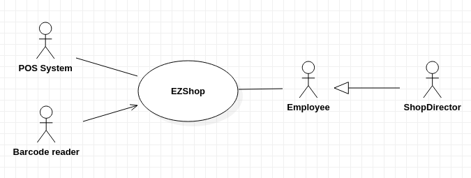
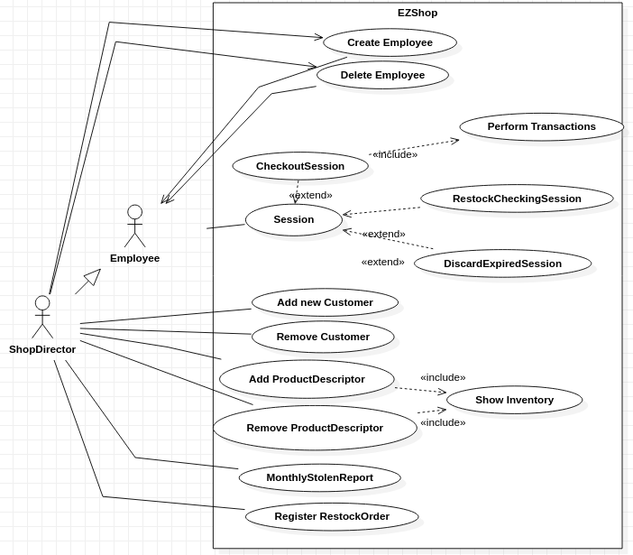
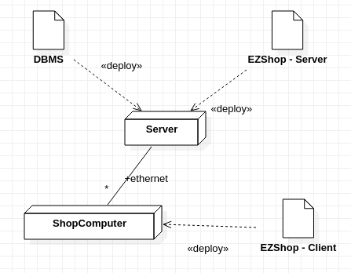

# Stakeholders
| Stakeholder name | Description                                                                                                                                                      |
| ---------------- | -----------                                                                                                                                                      |
| User             | Any user who can interact with the system: - Cashier  - Owner  - Shop Director  - Product Discarder  - Restock Checker  - Customer at POS   |
| Small shops      | Any type of small-medium sized business (from 50 to 200 square meters) with an inventory ranging from 500 to 2000 different types of products.                   |
| POS System       | The system interacts with a POS type application for managing transactions                                                                                       |
| Developer        | Who develops and maintains the system (software engineer, marketing person, bank's IT specialist)                                                                |
| IT Administrator | Administrator of the IT System                                                                                                                                   |
| Revenue agency   | gets shop's monthly accounting update notification                                                                                                               |
| Barcode reader   | Barcode used to scan products                                                                                                                                    |
| Product          | Sold goods                                                                                                                                                       |

# Context Diagram and interfaces

## Context Diagram

## Interfaces
| Actor          | Logical Interface | Physical Interface                              |
| -------------  | :-------------:   | -----:                                          |
| Personnel, ShopDirector   | GUI               | Screen, monitor, keyboard, mouse, cash register |
| POS System     | POS API           | Ethernet cable                                  |
| Barcode system | Driver            | Barcode reader                                  |

# Stories and personas

John is the shop owner and director of a small shop of 50-200 square meters and sells about 500-2000 different item types.
John's shop has 4 different checkouts, and 12 employees.

John uses the application EZSHOP in order to manage his shop.

John is able to easily keep the inventory in the application and the actual number of goods inside the shop in sync by compiling every month a MonthlyStolenReport(a list of the missing items in the shop, it is compiled once a month).
In order to do so, John asks his employees to count all the goods present in the shop, which he then compares with the inventory tracked by the application.
After inserting the Monthly stolen report in the application, John can be sure that his inventory will always be coherent with the actual number of items in stock.

John also wants to know actual statistics about his shop earnings and losses, to do so, he accesses the monthly accounting page, in which he has a detailed list of the earnings and expenses he got in previous months.

Everytime he wants to order new goods, he accesses the RestockOrder page, in which he inserts The date and the cost of the order, which will be automatically used by EZSHOP to calculate the monthly accounting, and the list of ordered products.

John can easily manage all his personnel from EZSHOP, he can change their salary and password, hire them, and fire them. The salary is automatically tracked by the monthly accounting.

In case the inventory needed to be updated, the shop director is able to manage the inventory by adding or removing products but also by updating the properties of the goods present in the EZSHOP inventory, such as the price at which they are sold or the reorder threshold.

John can easily see when it has to order a new stock of a product. The Inventory view has the option to only display those item whose quantity is below a specific quantity threshold associated to them.

When John wants, through the "session activities view" he can access to the records for the sessions of his Personnel and view some information that may interest him, such as when the session was started and ended.

If the shop is crowded, and all of his personnel is busy, john can still help the shop remain efficient by behaving as an additional member of the personnel, since EZSHOP gives him the option of starting all the types of Sessions.

______________________________________________________________________________________________
Sara,Tom, Tia and Mike are four of John's employees. As Personnel, they can carry out many duties, from reordering the shelves, to cleaning. The EZSHOP application keeps them flexible in changing their tasks while still being tracked by the system when needed. 

When its Sara's turn to work at the checkout, she borrows a cash container containing cash from the shop, which she uses to give the rest to clients and  logs in using the credentials provided to her by John. 
In order to correctly initiate the checkout session, she has to insert the borrowed amount into her terminal to let the system know her debt.
Once the Checkout session is initiated, Sara is able to start a new transaction for each of her customers, and the system keeps track of the amount of money she has earned during the checkout session.
When sara has to end her checkout session, before she returns the cash container, the system asks her to count the amount of money in it and to log it. 
If the system automatically warns the shopdirector if the money she gathered are too low  compared to what she should have had.

When the goods ordered by the shop director arrive to she shop, Tom can login as a RestockChecker, select the received order from the list of Restock Orders to retrieve the list of ordered items and check them. The system automatically updates the inventory without him having to do it manually. Morover, Tom has also the possibility of raise issues to the shopdirector, regarding some of the goods he has received by stating the affected products and quantity.

With the term customers, we mean the people which buy in the shop using a Loyalty Card. When Tia logs in in a ManageCustomerSession, she is able to create new Loyalty cards and associate them to customers, morover, she can search through customer data in order to visualize the name, surname and SSN of the customer which has a specific cardID and the Amount of points associated to that card.

When Mike is reordering the shelves, and finds that a product has expired, he is able start a DiscardExpiredSession, which lets him scan the expired products. Thanks to this procedure, Mike is able to discard the expired products while still keeping the inventory synchronized with the actual number of items present in the shop.

_____________________________

Michael is a customer of the shop. When he wants to buy some products, he is not forced to have a Loyalty card with him, unless those products are specific promotional products which have a cost in Loyalty Card points. 
Since he wants to buy a product which needs Loyalty Card points to be bought, he asks to Sara, one of the personnel in the shop.
Sara logs into the system's "ManageCustomerSession" and enters Michael's details. Michael's data will be  associated him to a specific card and stored. Then Sara hands him the loyalty card.
Michael's Loyalty card increases its point value at each transaction, depending on the cumulative point value of the bought products, in the same way, points are subtracted from the card when a product point value is lower than 0.

# Functional and non functional requirements
## Functional Requirements
|            ID | Description                                                                    |                                      |
| ------------- | -------------                                                                  | -----                                |
|           FR1 | Manage sales                                                                   |                                      |
|             1 | Start new Transaction                                                          |                                      |
|             2 | Scan products                                                                  |                                      |
|             3 | Calculate total Amount                                                         |                                      |
|             4 | Check Credit Card use                                                          |                                      |
|             5 | Update quantity in ProductDescriptor for each sold product                     |                                      |
|             6 | Rollback ongoing transaction                                                   |                                      |
|             7 | Update fidelity points                                                         |                                      |
|             8 | End Transaction                                                                |                                      |
|               |                                                                                |                                      |
|           FR2 | Manage inventory                                                               |                                      |
|             1 | Add new ProductDescriptor                                                      |                                      |
|             2 | Remove Product Descriptor                                                      |                                      |
|             3 | Update Product Descriptor Properties                                           |                                      |
|             4 | Show inventory                                                                 |                                      |
|             5 | Show products under quantity threshold                                         |                                      |
|               |                                                                                |                                      |
|           FR3 | Manage customers                                                               |                                      |
|             1 | Add loyalty card code                                                          |                                      |
|             2 | Store customer data                                                            |                                      |
|             3 | Remove customer                                                                |                                      |
|             4 | Update fidelity points                                                         |                                      |
|               |                                                                                |                                      |
|           FR4 | Support accounting                                                             |                                      |
|             1 | Perform MonthlyStolenReport                                                    |                                      |
|           1.1 | Get stolen product list                                                        |                                      |
|           1.2 | Calculate total cost of stolen products                                        |                                      |
|           1.3 | Update inventory                                                               |                                      |
|               |                                                                                |                                      |
|             2 | Perform DiscardExpiredSession                                                  |                                      |
|           2.1 | Compute totalDiscardedCost                                                     |                                      |
|           2.2 | Get discardedProductList                                                       |                                      |
|           2.3 | Update Inventory                                                               |                                      |
|               |                                                                                |                                      |
|             3 | Track RestockOrders(order number, date, moneyCost, Suppliers)                  |                                      |
|           3.1 | Get List of ordered products                                                   |                                      |
|           3.2 |Show list of restock orders with state "checked"                                |                                      |
|               |                                                                                |                                      |
|             4 | Perform RestockCheckingSession                                                 | (?)                                  |
|           4.1 | Select restock order to check and show it's content                            |                                      |
|           4.2 | Update inventory                                                               |                                      |
|           4.3 | send RestockIssue to Director                                                  |                                      |
|               |                                                                                |                                      |
|             5 | Perform CheckoutSession                                                        |                                      |
|           5.1 | Get Starting cash amount                                                       |                                      |
|           5.2 | Accumulate Transaction value                                                   |                                      |
|           5.3 | Update CurrentCashAmount                                                       |                                      |
|           5.4 | End CheckoutSession                                                            |                                      |
|         5.4.1 | Get human-counted final cash amount                                            |                                      |
|         5.4.2 | Notify ShopDirector if (CurrentCashAmount - human-counted) > checkoutThreshold |                                      |
|               |                                                                                |                                      |
|               |                                                                                |                                      |
|           FR5 | Manage Personnel                                                               |                                      |
|             1 | Hire Personnel                                                                 |                                      |
|           1.1 | Set PersonnelId                                                                |                                      |
|           1.2 | Set Salary                                                                     |                                      |
|           1.3 | Set Password                                                                   |                                      |
|             2 | Update Salary                                                                  |                                      |
|           2.1 | Get new salary                                                                 |                                      |
|           2.2 | Remove old salary from MonthlyAccounting                                       |                                      |
|           2.3 | Overwrite old salary                                                           |                                      |
|           2.4 | Add new salary to MonthlyAccounting                                            |                                      |
|             3 | Update Password                                                                |                                      |
|           3.1 | Get new password                                                               |                                      |
|           3.2 | Overwrite old password                                                         |                                      |
|             4 | Fire Personnel                                                                 |                                      |
|               |                                                                                |                                      |
|           FR6 | Authenticate User(Login and Logout)                                            |                                      |
|             1 | Get PersonnelId and Password                                                   |                                      |
|             2 | Verify Password is correct                                                     |                                      |
|               |                                                                                |                                      |
|           FR7 | Issue RestockOrder                                                             |                                      |
|               |                                                                                |                                      |
|           FR8 | Store Suppliers Data                                                           |                                      |
|               |                                                                                |                                      |

## Non Functional Requirements
| ID            | Type (efficiency, reliability, .. see iso 9126) | Description                                                                                                | Refers to FR |
| ------------- | :-------------:                                 | :-----:                                                                                                    | -----:       |
| NFR1          | Usability                                       | Time to learn how to use  < 1 hour of training + 7 hour of practice                                        |              |
| NFR2          | Functionality                                   | Data stored must be available 24 hrs/ 24 7 days/ 7                                                         | FR2          |
| NFR3          | Efficiency                                      | GUI response time less than 0.5s                                                                           | FR1.2        |
| NFR4          | Efficiency                                      | Support up to 10 Checkouts                                                                                 |              |
| NFR5          | Efficiency                                      | Support up to 2000 different ProductDescriptors                                                            | FR2          |
| NFR11         | Efficiency                                      | Support for up to 20 employees(personnel)                                                                  |              |
| NFR13         | Efficiency                                      | Support for up to 15 active Sessions at a time                                                             |              |
| NFR6          | Maintainability                                 | Time to restore system < 1 hr                                                                              |              |
| NFR7          | Reliability                                     | number of data backup per day >= 1                                                                         |              |
| NFR8          | Security                                        | For credit card payments only last 4 digits are stored                                                     |              |
| NFR9          | Portability                                     | The application must be compatible with Windows based systems (Windows 7 version or later) for x86 systems and Windows Embedded Compact for embedded terminals                |              |
| NFR10         | Usability                                       | Gui uses large buttons and large text size in order to be easily usable for people with sight deficiencies |              |
| NFR12         | localization                                    | decimal numbers use .(dot) as decimal separator                                                            |              |
| NFR14         | Reliability                                     | Save to disk every transaction performed                                                                   |              |
| NFR11         | Reliability                                     | If power outage occurs during a transaction, roll back to the previous stable state of the system          |              |
| NFR14         | Security                                        | Accept only Passwords longer than 8 characters                                                             |              |
| NFR15         | Performance                                     | All mathematical operations performed by the system must be correct with maximum tolerance of 10^-3        |              |
| NFR16         | Usability                                       | The EZSHOP GUI always shows the current time, helping the personnel know when to take breaks               |              |
| NFR17         | Usability                                       | Presence of warning in case values inserted in the GUI are outside the range in which they are meaningful  |              |
| NFR18         | Functionality                                   | Support for hand-held barcode scanners with basic IP54 protection, 3.5 in. color TFT display |
| NFR19         | Functionality                                   | Support for Ingenico, MacLean MC Series and myPOS POS terminals |
| NFR20         | Localization                                   | Money amounts are expressed in $ |

# Use case diagram and use cases
## Use case diagram

## Use Cases
### Use case 1, Create Personnel
| Actors Involved  | Personnel, Shop Director                                                                                                                 |
| -------------    | -------------                                                                                                                            |
| Precondition     | User is logged in as ShopDirector                                                                                                        |
| Post condition   | Personnel Account created(salary, password and personnelID have been assigned to it)                                                     |
|                  | totalSalaryCost in MonthlyAccounting has been updated                                                                                    |
| Nominal Scenario | ShopDirector creates new user specifying some specific attributes(salary, personellID and password                                       |
|                  | Personnel User is created with the inserted info as attributes, the attribute totalSalaryCost in MonthlyAccounting is updated            |
|                  |                                                                                                                                          |
| Variant          | PersonnelID is already taken by another member of the Personnel or has not been inserted, issue warning, ask for alternative PersonnelId |
|                  | Salary inserted is negative, issue warning, ask for alternative                                                                          |
|                  | Password inserted is shorter than 8 characters or empty, issue warning                                                                   |

### Use case 2, Delete Personnel
| Actors Involved  | Personnel, Shop Director                                                            |
| -------------    | -------------                                                                       |
| Precondition     | User is logged in as ShopDirector, Personnel Account to delete exist                |
| Post condition   | Personnel Account does not exist anymore, totalSalaryCost has been updated          |
| Nominal Scenario | ShopDirector, through the gui interface, finds the target account and clicks delete |
| Variant          |                                                                                     |

### Use case 3, Update Personnel salary
| Actors Involved  | Personnel, Shop Director                                                                          |
| -------------    | -------------                                                                                     |
| Precondition     | User is logged in as ShopDirector, Personnel Account to which update the salary exists            |
| Post condition   | Personnel's salary has been updated, totalSalaryCost has been updated                             |
| Nominal Scenario | ShopDirector, through the gui interface, finds the target account and changes the value of salary |
| Variant          | The value entered as salary is negative, stop the operation and issue a warning                   |
### Use case 4, Update Personnel password
| Actors Involved  | Personnel, Shop Director                                                                              |
| -------------    | -------------                                                                                         |
| Precondition     | User is logged in as ShopDirector, Personnel Account to which to change password exists               |
| Post condition   | Personnel's password has been updated                                                                 |
| Nominal Scenario | ShopDirector, through the gui interface, finds the target account and changes the value of password   |
|                  |                                                                                                       |

### Use case 5, Perform RestockCheckingSession
| Actors Involved  | Personnel                                                                                                                                       |
| -------------    | -------------                                                                                                                                   |
| Precondition     | Personnel must be logged in, and he must have started a RestockChecking Session and selected a previously registered restock order                                                                 |
| Post condition   | Inventory is updated according to the checked goods                                                                                             |
| Nominal Scenario | Checks the Restocked items from the list of the order, then ends the Session                                                                     |
| Variant 1        | During The session a power loss occurs, The system restores itself as before the start of the RestockCheckingSession                            |
| Variant 2        | During the checking, one or more goods are damaged or any other problem occurs  =>  The user can raise an issue to the ShopDirector  |

### Use case 6, Perform Checkout Session
| Actors Involved  | Personnel                                                                                                                                                        |
| -------------    | -------------                                                                                                                                                    |
| Precondition     | Personnel must be logged in, and he must have started a CheckoutSession                                                                                          |
| Post condition   | Cashier Ends the session by logging the cash accumulated, totalCheckout in MonthlyAccounting is updated                                                          |
| Nominal Scenario | Cashier executes many transactions, then he ends the session by logging the amount of cash he accumulated                                                        |
| Variant 1        | The difference between the amount logged by the cashier and the correct amount is higher than the toleranceThreshold                                             |
|                  | The system sends a warning to the shopDirector                                                                                                                   |
| Variant 2        | Power outage occurs during checkout session, the system aborts all ongoing transactions and returns to the state corresponding to the last completed transaction |
|                  | the system rolls back to the state it was in,  when the last transaction has been completed                                                                      |
|                  |                                                                                                                                                                  |

### Use case 7, Start DiscardExpiredSession
| Actors Involved  | Personnel                                                                                                   |
| -------------    | -------------                                                                                               |
| Precondition     | Personnel must be logged in, and he must have started a Discard expired Session                             |
| Post condition   | Scanned products are removed from the inventory, costExpired in MonthlyAccounting is updated                |
| Nominal Scenario | Personnel opens a new session. Expired products are scanned with barcode reader, Personnel ends the Session |
| Variant          | Power outage occurs during the session, rolls back to the state it was in before starting the Session       |
| Variant 2        | Products can also be inserted by typing the barcode manually with a keyboard                                |

### Use case 8, Perform MonthlyStolenReport
| Actors Involved  | Personnel                                                                                                                      |
| -------------    | -------------                                                                                                                  |
| Precondition     | ShopDirector must be logged in, and he must have clicked MonthlyStolenReport                                                   |
| Post condition   | the MonthlyStolenReport for the month is computed, costStolen in MonthlyAccounting is updated                                  |
| Nominal Scenario | ShopDirector inserts the list of missing items, either by keyboard or by barcodeScanner, then he ends the Session              |
| Variant 1        | MonthlyStolenReport has already been compiled for the current month => the application warns the user and stops him from compiling it |

### Use case 9, Manage sales(Perform Transactions)
| Actors Involved  | Personnel                                                                                                                                   |
| -------------    | -------------                                                                                                                               |
| Precondition     | Personnel must be logged in, he must have an active CheckoutSession, he has started a new transaction                                       |
| Post condition   | Transaction has ended, scanned products are removed from the inventory,                                                                     |
|                  | TotalCheckout and currentCashAmount in CheckoutSession are updated, points on LoyaltyCard are updated                                       |
| Nominal Scenario | products are scanned with a barcode reader, buyer pays with cash, Personnel ends the Session                                                |
| Variant          | Products can also be inserted by typing the barcode number manually with a keyboard                                                         |
| Variant 2        | Power outage occurs during a transaction =>  the system doesn't save any operations performed by the transaction                            |
| Variant 3        | The customer isn't able to pay for a started transaction => cashier can undo all the changes occurred during the unfinished transaction     |
| Variant 4        | The buyer pays with a credit card instead of cash => currentCashAmount is not updated                                                       |
| Variant 5        | LoyaltyCard is not used, LoyaltyCard points are not updated                                                                                 |
| Variant 6        | a product with pointValue<0 has been scanned, but either the LoyaltyCard has not enough points or no Loyalty Card is present, issue warning |
| Variant 7        | The Buyer decides that he doesn't want a product that has already been scanned =>  the Cashier clicks the Remove button from that product   |
|                  |                                                                                                                                             |

### Use Case 10, Add new ProductDescriptor
| Actors Involved  | ShopDirector                                                                                                           |
| -------------    | -------------                                                                                                          |
| Precondition     | ShopDirector must be logged in, he must be in the Manage Inventory screen                                              |
| Post condition   | New Product Descriptor with valid attributes has been added to the inventory                                           |
| Nominal Scenario | the "+" button is clicked, the properties for the file descriptor are inserted and confirmed clicking "Add"            |
| Variant          | The Product Descriptor was already present in the inventory =>  issue a warning                                        |
| Variant 2        | one of the properties inserted is outside the range of specification => issue a warning                                |
|                  | Range of Specification means: Qty>=0, price >=0, 7<length(name)<15, productID can contain only numbers |

### Use Case 11, Remove Product Descriptor
| Actors Involved  | ShopDirector                                                              |
| -------------    | -------------                                                             |
| Precondition     | ShopDirector must be logged in, he must be in the Manage Inventory screen |
| Post condition   | Product Descriptor been removed from the inventory                        |
| Nominal Scenario | the Button "remove" is clicked                                            |

### Use Case 12, Show Inventory
| Actors Involved  | ShopDirector                                                                            |
| -------------    | -------------                                                                           |
| Precondition     | ShopDirector must be logged in                                                          |
| Post condition   | ShopDirector is able to scroll through the list of product descriptors in the Inventory |
| Nominal Scenario | ShopDirector clicks Manage Inventory                                                    |
|                  |                                                                                         |
|                  |                                                                                         |

### Use Case 13, Show Restock Issues
| Actors Involved  | ShopDirector                                                                            |
| -------------    | -------------                                                                           |
| Precondition     | ShopDirector must be logged in, he must be in manae restock issue view                  |
| Post condition   | ShopDirector is able to scroll through the list of Restock Issues                       |
| Nominal Scenario | ShopDirector clicks Manage Restock Order, then clicks Manage Restock Issues             |
|                  |                                                                                         |
|                  |                                                                                         |

### Use Case 14, Delete Restock Issue
| Actors Involved  | ShopDirector                                                                            |
| -------------    | -------------                                                                           |
| Precondition     | ShopDirector must be logged in and on the Restock Issue view                            |
| Post condition   | Restock Issue Is removed from the list                                                  |
| Nominal Scenario | ShopDirector clicks "Delete" button on the correspoding Restock Issue                   |
|                  |                                                                                         |
|                  |                                                                                         |

### Use Case 15, Add new Customer
| Actors Involved  | Personnel                                                                                                                              |
| -------------    | -------------                                                                                                                          |
| Precondition     | Personnel  must be logged in, he must be in the Manage Customer Session                                           |
| Post condition   | New Customer with valid attributes has been added to the inventory                                                |
| Nominal Scenario | the attributes for the Customer are inserted and confirmed clicking "Register Customer"                           |
| Variant 2        | one or more the properties inserted is outside the range of specification => issue a warning                      |
|                  | Range of Specification means: length(name)>=0, length(surname)>=0, SSN must not be empty, Date of birth must not be empty, Loyalty Card's id must not be empty |
| Variant 3        | the inserted Loyalty Card's Id already identifies another Customer, issue warning                                 |

### Use Case 16, Remove Customer
| Actors Involved  | Personnel                                                                               |
| -------------    | -------------                                                                           |
| Precondition     | Personnel must be logged in, he must be in the Manage Customer Session                  |
| Post condition   | Customer has been successfully removed from the inventory                               |
| Nominal Scenario | Personnel inserts the customer's loyalty card number, then clicks Remove Customer Infos |
| Variant          | Inserted Card Id is not valid(No customer is associated to it)  => issue warning        |
|                  |                                                                                         |

### Use Case 17, Update ProductDescriptor
| Actors Involved  | Personnel                                                                               |
| -------------    | -------------                                                                           |
| Precondition     | ShopDirector must be logged in, he must be in the Manage Inventory screen               |
| Post condition   | One product descriptor field value has been updated                                     |
| Nominal Scenario | ShopDirector doubleclicks the targeted field and inserts the new value                  |
| Variant          | ShopDirector tries to dubleclick ProductId (immutable field) => nothing happens            |
|                  |                                                                                         |

# Relevant scenarios
## Scenario 1
| Scenario ID:   | Corresponds to UC 1 Create Personnel                                                                                |
| -------------  | -------------                                                                                                                          |
| Description    | Shopdirector wants to hire a new member of the personnel                                                            |
| Precondition   | User is logged in as ShopDirector, in the manage personnel Screen                                                   |
| Post condition | Personnel Account created(salary, password and personnelID have been assigned to it),  totalSalaryCost in MonthlyAccounting is updated |
| Step#          |                                                                                                                                        |
| 1              | ShopDirector enters the attributes for the personnel member(salary, personellID and password)                                          |
| 2              | Check for the validity of the attributes(see usecase variants), if not send a warning and go to step 1                                 |
| 3              | the salary of the employee is added to totalSalaryCost in MonthlyAccounting                                                            |
| 4              | a new instance of Personnel is created                                                                                                 |

## Scenario 2
|   Scenario ID: | Corresponds to UC 2 Delete Personnel                                                                |
|  ------------- | -------------                                                                                       |
|    Description | Shopdirector wants to delete a member of the personnel                                              |
|   Precondition | User is logged in as ShopDirector in the manage personnel Screen                                    |
| Post condition | Personnel Account does not exist anymore, totalSalaryCost has been updated                          |
|          Step# |                                                                                                     |
|              1 | ShopDirector inserts the personnelID of the member to remove from the system                        |
|              2 | check for the existence of a personnel with such personnelID                                        |
|              3 | The system displays the info about that personnel                                                   |
|              4 | ShopDirector clicks the delete button and confirms the action                                       |
|              5 | totalSalaryCost in MonthlyAccounting is decreased by the amount of salary the deleted Personnel had |
|              6 | the Personnel Account is Removed                                                                    |
## Scenario 3
|   Scenario ID: | Corresponds to UC 3 Update Salary                                                                             |
|  ------------- | -------------                                                                                                 |
|    Description | Shopdirector wants to update the salary of a member of the personnel                                          |
|   Precondition | User is logged in as ShopDirector in the manage personnel Screen                                              |
| Post condition | Personnel Account's attributes have been updated, totalSalaryCost in MonthlyAccounting has been updated       |
|          Step# |                                                                                                               |
|              1 | ShopDirector inserts the personnelID of the member to update the salary of                                    |
|              2 | check for the existence of a personnel with such personnelID, if not issue a warning and step back to step 1  |
|              3 | The system displays the info about that personnel                                                             |
|              4 | ShopDirector clicks the Update salary button                                                                  |
|              5 | the inserted salary is checket to be bigger than zero, if not the user is asked to insert another valid value |
|              6 | totalSalaryCost in MonthlyAccounting is increased by the difference between the new and the old salary        |

## Scenario 4
|   Scenario ID: | Corresponds to UC 4 Update Salary                                                                            |
|  ------------- | -------------                                                                                                |
|    Description | Shopdirector wants to update the password of a member of the personnel                                       |
|   Precondition | User is logged in as ShopDirector in the manage personnel Screen                                             |
| Post condition | Personnel Account's attributes have been updated, totalSalaryCost in MonthlyAccounting has been updated      |
|          Step# |                                                                                                              |
|              1 | ShopDirector inserts the personnelID of the member to update the password of                                 |
|              2 | check for the existence of a personnel with such personnelID, if not issue a warning and step back to step 1 |
|              3 | The system displays the info about that personnel                                                            |
|              4 | ShopDirector clicks the Update Password button                                                               |
|              5 | the inserted Password to be of sufficient length, if not the user is asked to insert another valid value     |
|              6 | The password of that personnel account is changed                                                            |

## Scenario 5
|   Scenario ID: | Corresponds to UC 5 Perform RestockCheckingSession                              |
|  ------------- | -------------                                                                   |
|    Description | Personnel checks the new arrived products for issues and counts them            |
|   Precondition | User is logged in and he must have started a RestockCheckingSession             |
| Post condition | the inventory is updated according to the scanned goods                         |
|          Step# |                                                                                 |
|              1 | each time a product is scanned add it to a list                                 |
|              2 | (?) non continuo perchè non sono sicurissimo di come funzioni l'interfaccia qui |
|              3 |                                                                                 |
|              4 |                                                                                 |
|              5 |                                                                                 |
|              6 |                                                                                 |

## Scenario 6
|   Scenario ID: | Corresponds to UC 6 PerformCheckoutSession   |
|  ------------- | -------------                                |
|    Description | Personnel performs his work shift as cashier |
|   Precondition |                                              |
| Post condition |                                              |
|          Step# |                                              |
|              1 |                                              |
|              2 |                                              |
|              3 |                                              |
|              4 |                                              |
|              5 |                                              |
|              6 |                                              |

## Scenario 7

# Glossary
| Class name | Meaning |
| ---------- | ------- |
| CheckoutSession | Session opened by a cashier to manage one or more transactions |
| RestockCheckingSession | Session opened by an employee when goods are arrived.  # of products arrived can be compared with # of products ordered. Any issues can be reported to the ShopDirector. |
| DiscardExpiredSession | Session opened by an employee to scan expired products |
| MonthlyAccounting | Monthly accounting of the shop, calculated by the system. It takes into account all possible income and expenses. Only ShopDirector can access to it |
| Transaction | Represents the purchase of items from a buyer |
| MonthlyStolenReport | Class that stores a list of items found to be missing in the shop, it also calculates the total money loss due to missing items. It is necessary in order to perform the calculation of the monthly accounting |

</img>
# System design

# Deployment diagram

